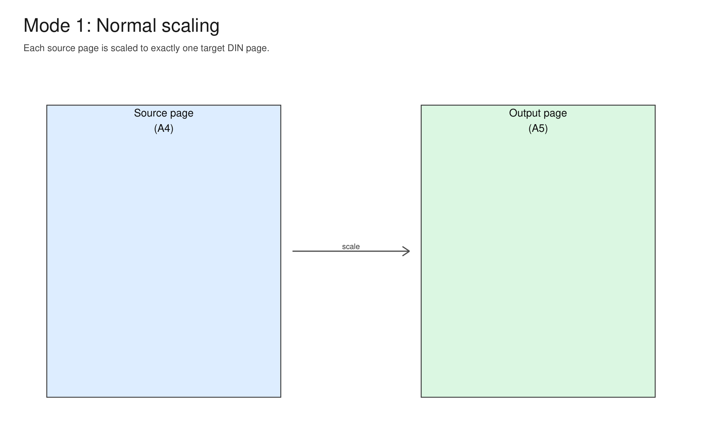
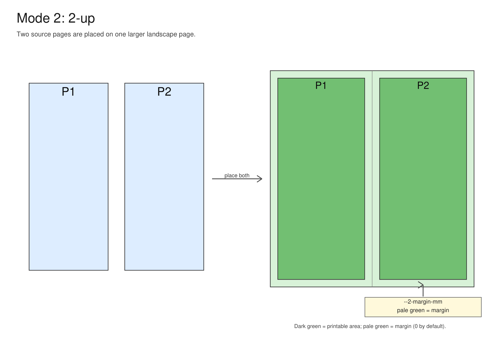
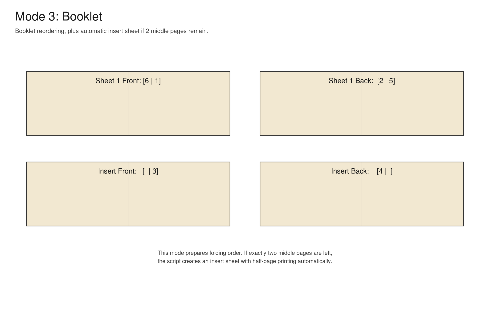
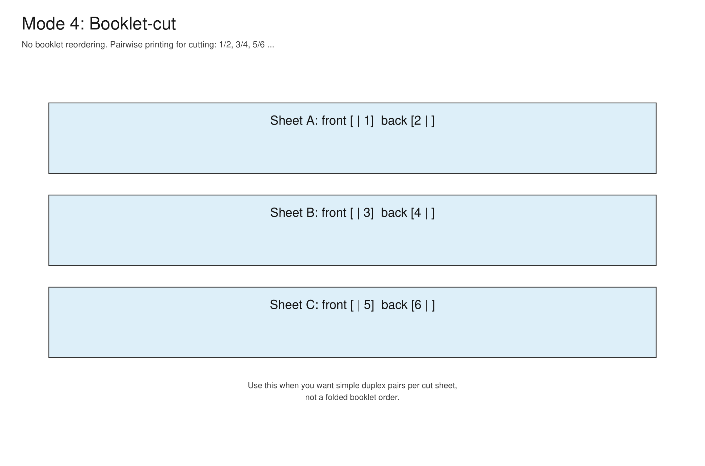

# scale-pdf

Small CLI tool for scaling and reordering PDFs with PyMuPDF.

## Requirements

- Python 3.13+
- Install dependencies (with uv):

```powershell
uv sync
```

## Quick Start

- Interactive UI (recommended):

```powershell
uv run .\main.py --ui
```

- Running without parameters also starts the UI:

```powershell
uv run .\main.py
```

- Direct usage with flags:

```powershell
uv run .\main.py --din A5 .\file.pdf
```

## Language (Output)

- Supports German and English.
- Default is German (de).
- Switch language with --lang:

```powershell
uv run .\main.py --lang de .\file.pdf
uv run .\main.py --lang en .\file.pdf
```

In interactive mode, you can also choose the language at startup.

## Modes

1. Normal scaling

   Each page is scaled to the selected DIN format (e.g. A4 -> A5).

2. 2-up

   Two source pages are placed on one output page.
   The output page uses the next larger DIN format in landscape orientation
   (e.g. A5 -> A4 landscape).
   Optional: set an inner margin per half page using --2-margin-mm.

3. Booklet

   Classic booklet page ordering for duplex printing and folding.
   If exactly 2 middle pages remain at the end, the tool automatically
   creates an insert sheet with half-page printing.

4. Booklet-Cut

   No booklet reordering.
   Only one half of each sheet is printed; the other half stays blank
   for cutting.
   Pages are processed in pairs: 1/2, 3/4, 5/6, ...

## Examples

- Normal scaling:

```powershell
uv run .\main.py --din A4 .\a.pdf
```

- 2-up with margin:

```powershell
uv run .\main.py --din A5 --2-on-page --2-margin-mm 3 .\brochure.pdf
```

- Booklet:

```powershell
uv run .\main.py --din A5 --booklet .\brochure.pdf
```

- Booklet-cut:

```powershell
uv run .\main.py --din A5 --booklet-cut .\brochure.pdf
```

## Visual Mode Examples

Generate the visual examples via command line:

```powershell
uv run .\scripts\generate_mode_visuals.py
```

Images are written to the examples folder:

- Normal scaling:



- 2-up:



- Booklet:



- Booklet-cut:


